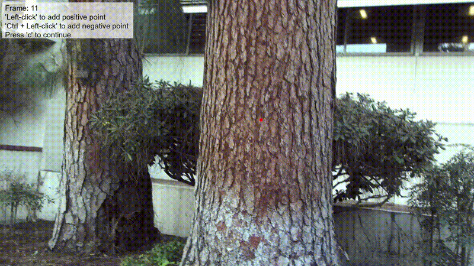
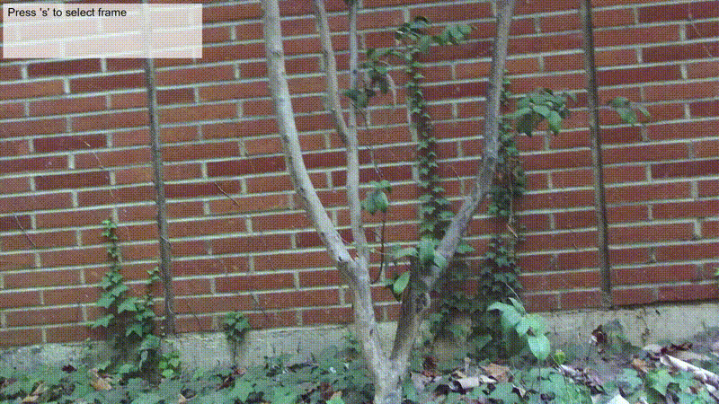
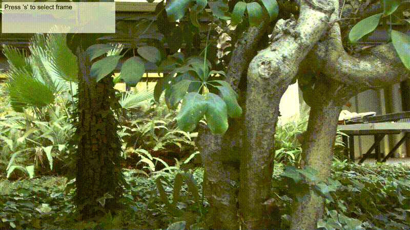
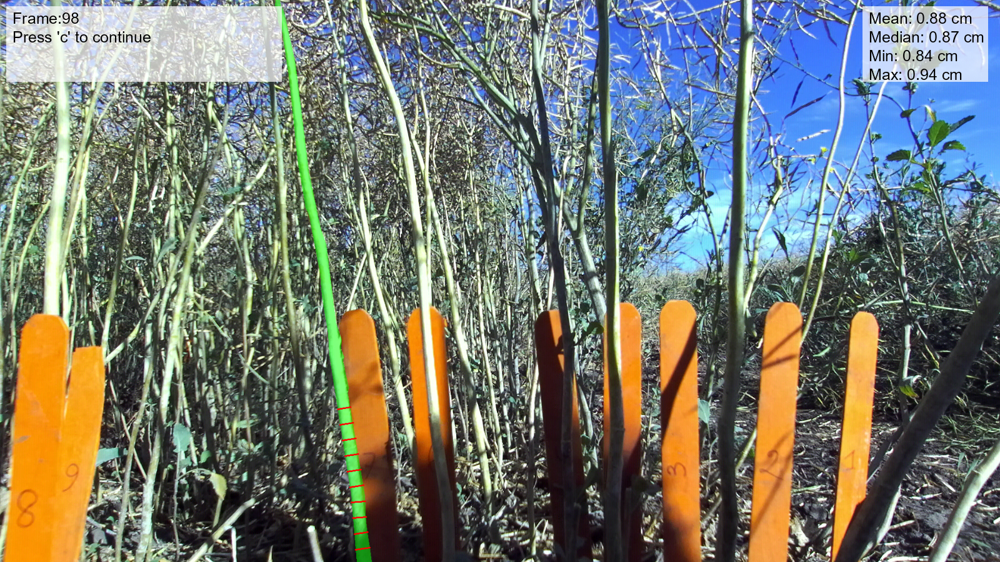
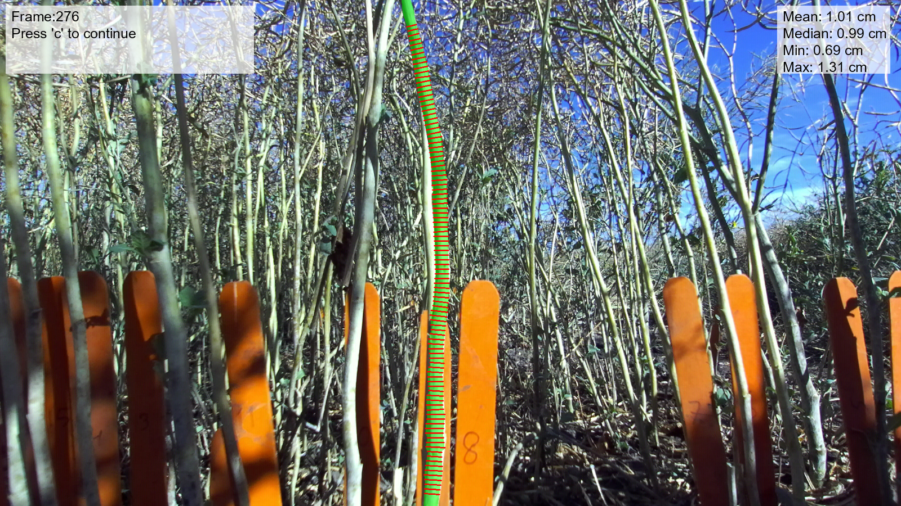

# Measure Anything: Real-time, Multi-stage Vision-based Dimensional Measurement using Segment Anything

---
**Measure Anything** is an **interactive** / **automated** dimensional measurement tool that leverages the [Segment Anything Model (SAM) 2](https://github.com/facebookresearch/sam2) to segment objects of interest and provide detailed, real-time diameter, length and volume analysis. Our streamlined pipeline comprises four stages: 1) segmentation, 2) binary mask processing, 3) skeleton building, and 4) depth triangulation. We envision that this pipeline can be adapted to other fully automated or minimally human-assisted, vision-based measurement tasks.


[[`Paper`](https://google.com/)] [[`Project`](https://google.com/)]

<p align="center">
  
  
</p>
<p align="center">
  
  
</p>
<p align="center"><em>Interactive Demo Examples</em></p>

---
# Installation #
### 1. Create conda environment for managing dependencies ###
```bash
$ conda create --name <environment> python=3.12
$ conda activate <environment>
```
### 2. Setting up the ZED SDK and Python API ###
This repository was tested with the ZED SDK 4.2.1 and CUDA 12 on Ubuntu 22.04. To set up the ZED SDK, follow these steps:
- Install dependencies
```bash
$ pip install cython numpy==1.26.4 opencv-python==4.9.0.80 pyopengl
```
- Download the ZED SDK from the [official website](https://www.stereolabs.com/developers/release#82af3640d775)
- Run the ZED SDK Installer
```bash
$ cd path/to/download/folder
$ sudo apt install zstd
$ chmod +x ZED_SDK_Ubuntu22_cuda12.1_v4.2.1.zstd.run
$ ./ZED_SDK_Ubuntu22_cuda12.1_v4.2.1.zstd.run
```
- To install the Python API, press Y to the following when running the installer:
``` bash
Do you want to install the Python API (recommended) [Y/n] ?
``` 
  or alternatively, you can install the Python API separately running the following script:
```bash
$ cd "/usr/local/zed/"
$ python3 get_python_api.py
````
### 3. Install Pytorch ###
- Follow instructions on the [official website](https://pytorch.org/get-started/locally/)
- For example, to install Pytorch with CUDA 12.1:
```bash
$ pip3 install torch torchvision torchaudio --index-url https://download.pytorch.org/whl/cu121
```
### 4. Install Ultralytics ###
We use the SAM2 API provided by Ultralytics. The Segment Anything Model checkpoint will be downloaded automatically when running the the demo code for the first time.
```bash
$ pip install ultralytics
```
### 5. Install remaining dependencies ###
```bash
$ pip install scikit-image scikit-learn pillow
```
---
# Demo #
## Interactive Demo ##
The interactive demo requires `.svo` files from the ZED camera. Example `.svo` files can be found [here](https://drive.google.com/drive/folders/1Q6). Run the demo and follow onscreen instructions.
```bash
python interactive_demo.py --input_svo path/to/svo/file.svo --stride 10 --thin_and_long
```
- `--thin_and_long` is a flag variable that decides the skeleton building method. It is recommended for thin, elongated objects only.
- `--stride (int)` is an optional parameter that determines the distance between consecutive measurements. The default value is 10.
- Red line indicate valid measurements.
- Blue line segments indicate invalid measurements, due to unavailable depth data.
- The calculated stem diameters are available as a numpy file in `./output/{svo_file_name}/{frame}/diameteres.npy` ordered from the bottom most to the topmost line measurements.


[//]: # (The `--stride` and `--measurement_threshold` are optional parameters. `--stride` determines the distance between consecutive measurements, while `--measurement_threshold` specifies the proportion of the image height below which measurements are taken. For instance, setting `--measurement_threshold = 0.5` will limit measurements to the bottom half of the image. The default values for these parameters are 10 for `--stride` and 0.95 for `--measurement_threshold`.)

[//]: # (<p align="center">)

[//]: # (  <figure style="display: inline-block; width: 49%; margin: 0;">)

[//]: # (    )

[//]: # (    <figcaption style="text-align: center;">stride=30, measurement_threshold=0.3</figcaption>)

[//]: # (  </figure>)

[//]: # (  <figure style="display: inline-block; width: 49%; margin: 0;">)

[//]: # (    )

[//]: # (    <figcaption style="text-align: center;">stride=10, measurement_threshold=0.95</figcaption>)

[//]: # (  </figure>)

[//]: # (</p>)

## Automated Demo using Keypoint Detection ##
